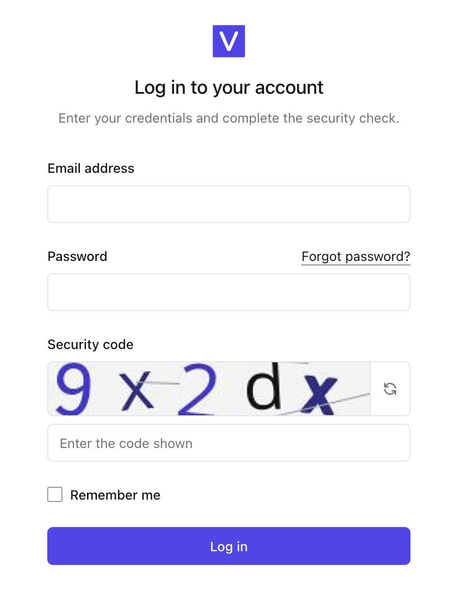

# Vito CAPTCHA

A VitoDeploy 4.x plugin that protects the login form with a self-hosted image CAPTCHA powered by [`mews/captcha`](https://github.com/mewebstudio/captcha). It does not call an external CAPTCHA service.

## Preview



## Requirements

- VitoDeploy 4.x
- PHP 8.4 with the GD extension
- `mews/captcha` 3.5 or newer, installed in the VitoDeploy application

The plugin installer intentionally does not modify VitoDeploy's Composer dependencies.

## Installation

From the root of your VitoDeploy installation, install the CAPTCHA dependency first:

```bash
composer require mews/captcha:^3.5
php artisan optimize:clear
```

Then install the plugin from the VitoDeploy dashboard:

1. Open **Admin → Plugins**.
2. Install the GitHub repository for this plugin, or place it at `app/Vito/Plugins/Cp6/VitoDeployCaptchaPlugin` for local development.
3. Enable **Login CAPTCHA**.

The plugin checks for both `mews/captcha` and GD during installation. If either is missing, VitoDeploy leaves the plugin uninstalled or disabled and records the reason in the plugin log.

## Configuration

The defaults work without any configuration. Add any of these values to VitoDeploy's `.env` to customise the challenge:

```dotenv
VITO_CAPTCHA_ENABLED=true
VITO_CAPTCHA_RATE_LIMIT=30
VITO_CAPTCHA_LENGTH=5
VITO_CAPTCHA_WIDTH=220
VITO_CAPTCHA_HEIGHT=56
VITO_CAPTCHA_EXPIRE=120
VITO_CAPTCHA_MATH=false
VITO_CAPTCHA_CASE_SENSITIVE=false
VITO_CAPTCHA_CHARACTERS=2346789ABCDEFGHJKLMNPQRTUVWXYZ
VITO_CAPTCHA_ANGLE=12
VITO_CAPTCHA_LINES=3
VITO_CAPTCHA_BACKGROUND_COLOR="#f4f4f5"
VITO_CAPTCHA_LINE_COLOR="#a1a1aa"

VITO_CAPTCHA_HEADING="Log in to your account"
VITO_CAPTCHA_DESCRIPTION="Enter your credentials and complete the security check."
VITO_CAPTCHA_LABEL="Security code"
VITO_CAPTCHA_PLACEHOLDER="Enter the code shown"
VITO_CAPTCHA_ERROR="The security code is incorrect. Please try the new code."
```

After changing configuration, rebuild VitoDeploy's configuration cache:

```bash
php artisan optimize:clear
php artisan config:cache
```

Setting `VITO_CAPTCHA_ENABLED=false` restores VitoDeploy's original login screen on the next request after the configuration cache is refreshed.

Do not set the upstream package's `CAPTCHA_DISABLE` variable in production; it bypasses CAPTCHA validation.

## Behaviour

- The CAPTCHA is generated and validated on the VitoDeploy server.
- Each challenge is stored in the existing Laravel session and cache.
- A submitted challenge is single-use, whether it succeeds or fails.
- CAPTCHA image generation is limited to 30 requests per IP address per minute by default.
- VitoDeploy's existing login throttling, authentication, remember-me option, password reset, and two-factor flow remain unchanged.
- Disabling the plugin restores the original Inertia login page.

## Updating

GitHub releases and tags are used by VitoDeploy's plugin updater. Review VitoDeploy and `mews/captcha` compatibility before upgrading either dependency across a major version.

## Tests

The feature suite is designed to run from a VitoDeploy 4.x checkout after this repository has been placed at `app/Vito/Plugins/Cp6/VitoDeployCaptchaPlugin`:

```bash
php artisan test app/Vito/Plugins/Cp6/VitoDeployCaptchaPlugin/tests/Feature/VitoCaptchaTest.php
```

## License

MIT
